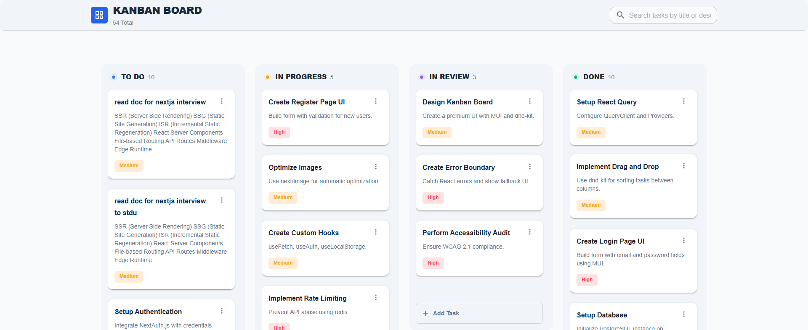
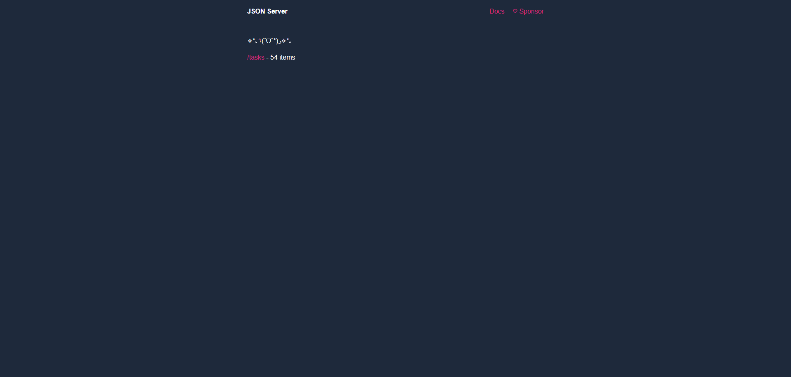
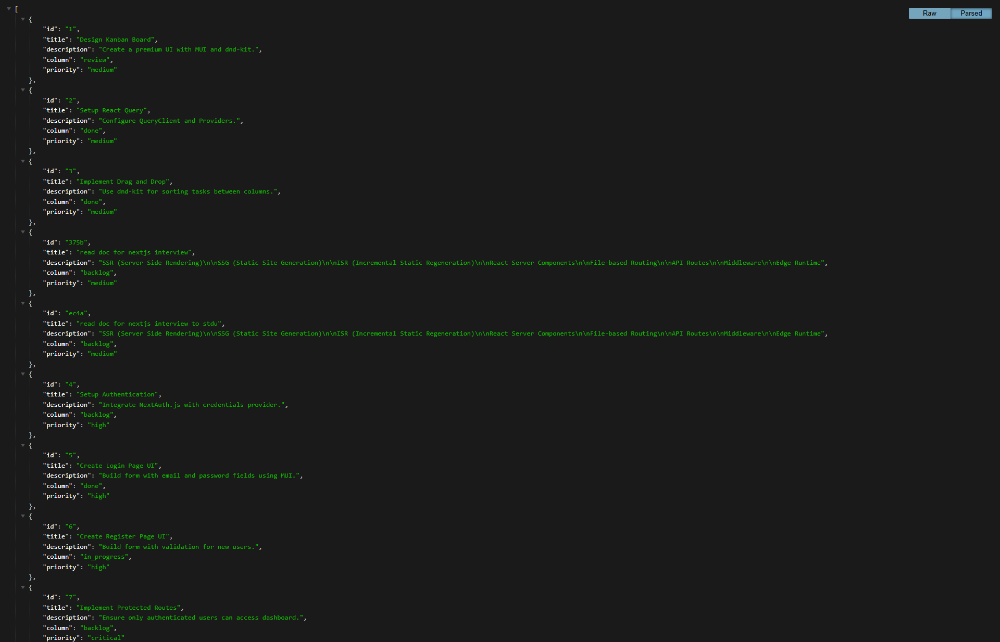

# Premium Kanban ToDo Dashboard

A high-performance, polished Kanban-style ToDo list application built with Next.js, Material UI, and React Query.

## 📸 Screenshots

| Dashboard Overview                                                                    | API Server (json-server)                                                      | API Tasks Endpoint                                                                 |
| :------------------------------------------------------------------------------------ | :---------------------------------------------------------------------------- | :--------------------------------------------------------------------------------- |
|  |  |  |

## Features

- **Kanban Board**: 4 columns (Backlog, In Progress, Review, Done).
- **Drag-and-Drop**: Smooth task movement between columns using `@dnd-kit`.
- **CRUD Operations**: Create, Read, Update, and Delete tasks with optimistic-like updates via React Query.
- **Infinite Scroll**: Automatic loading of more tasks as you scroll down each column.
- **Search**: Full-text search to filter tasks by title or description.
- **Premium UI**: Modern aesthetics using Material UI, custom theme, and smooth transitions.
- **Data Persistence**: Mock API powered by `json-server`.

## Tech Stack

- **Framework**: Next.js 15+ (App Router)
- **UI Library**: Material UI (MUI)
- **State Management**: Zustand (UI State)
- **Data Fetching**: React Query (TanStack Query)
- **Styling**: Emotion (MUI default)
- **Drag & Drop**: @dnd-kit
- **Mock API**: json-server

## 🛠️ Project Steps & Architecture

### 1. Conceptualization & Data Design

- Defined the task structure with `id`, `title`, `description`, `status` (Backlog, In Progress, Review, Done), and `priority`.
- Set up `db.json` for the initial mock data.

### 2. UI Foundation

- Implemented a custom MUI theme for a premium look.
- Created the main dashboard layout with a responsive drawer and appBar.

### 3. State Management & Data Fetching

- Used **React Query** for server state (fetching, caching, and updating tasks).
- Implemented **Zustand** for lightweight global UI states (like filters or modal controls).

### 4. Kanban Implementation

- Integrated `@dnd-kit` to handle drag-and-drop logic across columns and sorting within columns.
- Built reusable components: `TaskBoard`, `TaskColumn`, and `TaskCard`.

### 5. Performance Optimization

- Implemented infinite scrolling for task columns to handle large datasets efficiently.
- Used React Query's `useInfiniteQuery` for optimized paginated fetching.

## 🚀 How to Run

### Option 1: Using Docker (Recommended)

The easiest way to run the entire stack (Frontend + Mock API) is using Docker Compose.

1. **Build and Start**:

   ```bash
   docker-compose up --build
   ```

   - **Frontend**: [http://localhost:3000](http://localhost:3000)
   - **Mock API**: [http://localhost:4000](http://localhost:4000)

2. **Stop**:
   ```bash
   docker-compose down
   ```

### Option 2: Manual Setup (Local Development)

#### 1. Install Dependencies

```bash
npm install
```

#### 2. Run the Mock API Server

```bash
npm run server
```

_The server starts at `http://localhost:4000`._

#### 3. Run the Development Server

```bash
npm run dev
```

_The dashboard will be available at [http://localhost:3000](http://localhost:3000)._

## 📂 Project Structure

- `app/components/`: Reusable UI components (TaskBoard, TaskColumn, TaskCard, etc.)
- `app/hooks/`: Custom React Query hooks with `json-server` v1 compatibility.
- `app/stores/`: Zustand store for global UI state.
- `app/types.ts`: TypeScript definitions.
- `db.json`: Local database file.
- `screens/`: Application screenshots.
- `Dockerfile` & `docker-compose.yml`: Containerization configuration.
